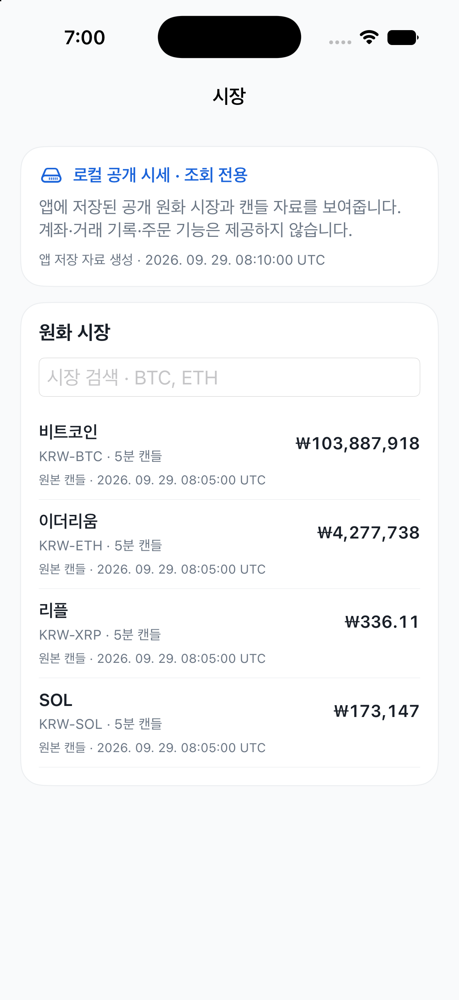

# Bundled Local Market visual check

## Audit scope

One screen in the `bundled-local` iOS build, captured in an iPhone 17 Simulator with a four-market synthetic pack. The screenshot is a visual check of the local read-only entry screen; it is not a full app, accessibility, or real-dataset audit.

## Steps

1. **Open the installed local-data build — visually clear.** The screen says the data is local and read-only, describes that account/order features are unavailable, and shows both the package creation time and each market's candle source time in UTC. The screenshot fixture is synthetic; its package timestamp is `2026-09-29T08:10:00Z` and its latest candle is `2026-09-29T08:05:00Z`, so the screen does not display a future date. A real local dataset was not available.
2. **Open a market and inspect its candle chart — not captured.** Store tests and the Simulator build cover the detail-data path, but no screenshot or accessibility-tree evidence was available for that screen on this host.

## Evidence limits

The screenshot uses a temporary synthetic pack, not live or user account data. The host did not expose `Simulator.app` or a Simulator accessibility tree, so VoiceOver, dynamic type, keyboard behavior, and accessibility contrast were not audited. Source attribution is a user-supplied `upbit-public-market-api` label and is not cryptographically authenticated.
