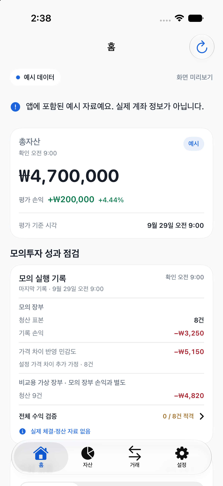
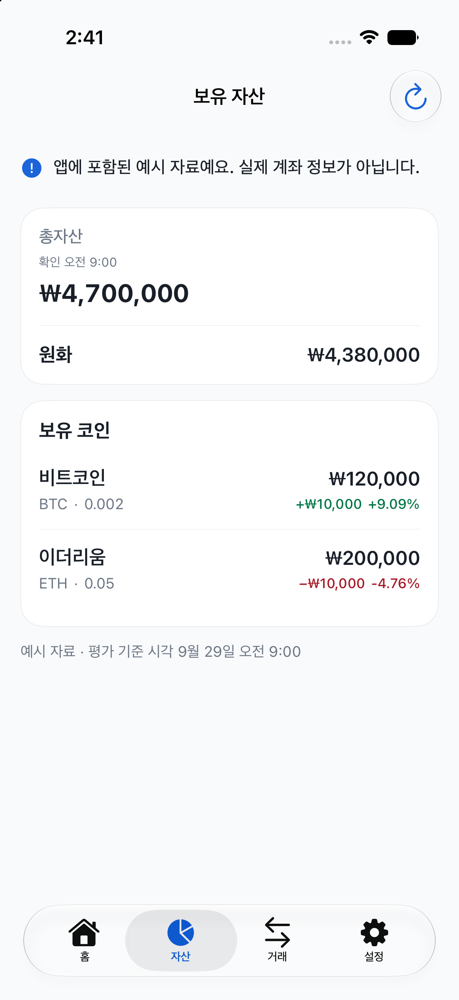
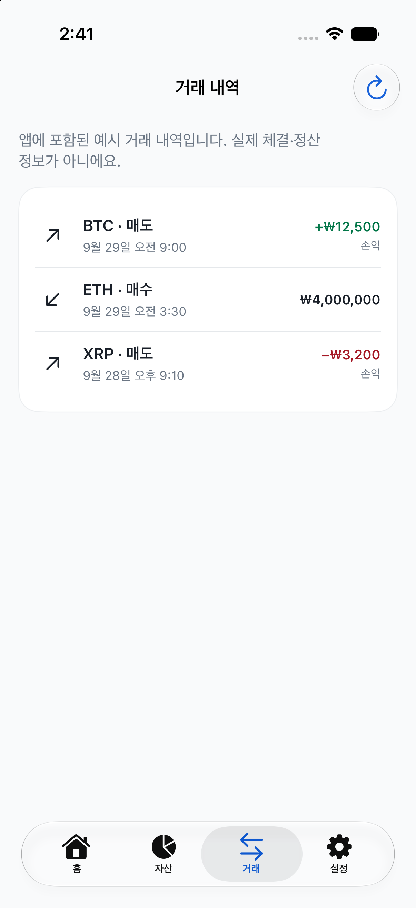
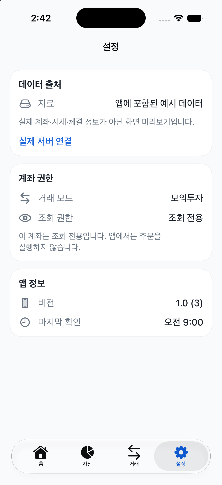
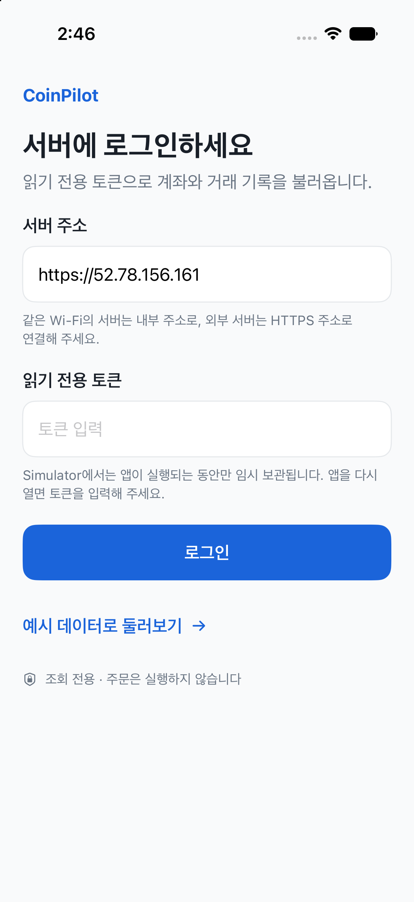

# CoinPilot native iPhone preview audit

- Date: 2026-09-29
- Surface: native SwiftUI app, iPhone 17 Simulator / iOS 27.0
- Build: local Debug `bundled-preview`; `CoinPilotDataMode=bundled-preview`, sample JSON embedded in the app bundle
- Flow: launch Home → Assets → Activity → Settings → server login setup → return to preview Home
- Goal: make example portfolio and paper results visibly distinct from real account, fills, and settlement data while keeping server access read-only

## Steps

1. **Home — healthy, sample clarity is essential.** The top view marks `예시 데이터` and says the included data is not actual account information. It shows a positive sample return (`+4.44%`) and paper cost comparison, but also displays `0 / 8건 적격` and `실제 체결·정산 자료 없음`. This is unusually consequential sample content, so the warning is appropriately near the results. Below-the-fold scrolling and Dynamic Type were not tested.

   

2. **Assets — healthy.** The page repeats the example-data warning, separates KRW cash from coin holdings, and labels the valuation timestamp. The shorter view has substantial whitespace, but the tab bar remains anchored and the data is not presented as a live account.

   

3. **Activity — healthy.** The page explicitly calls the rows example trades and says they are not actual fills or settlement. Positive and negative amounts are visually distinct. This is a sample-data screen, not evidence of an exchange trade.

   

4. **Settings — healthy.** Data source, simulated trading mode, read-only permission, and the no-order boundary are visible together. The user can switch from preview to server mode.

   

5. **Server setup — not submitted.** The screen asks for a read-only token, says Simulator tokens are held only while the app is running, and repeats that the app does not place orders. It displayed a prefilled HTTPS server address; its origin was not established in this audit. Switching modes reached the login state, which follows the native client's read-only authentication-status path when a server URL is configured. No token was entered, the Login action was not pressed, and no order route was called. Server-side request logs were not inspected, so the GET itself is not independently confirmed.

   

## Findings and limits

- Confirmed visual strength: the fictional preview is labelled on Home, Assets, Activity, and Settings, while fill/settlement absence is explicit on Home and Activity.
- Follow-up risk: the server setup address was prefilled even though this audit did not establish its source. Confirm the intended default/ownership before relying on that endpoint outside this local simulator review.
- Accessibility evidence is limited to the current simulator accessibility tree and screenshots. VoiceOver, larger text sizes, contrast measurement, and physical-device interaction were not tested.
- This is a local Simulator installation of the Debug bundled-preview build, not the signed TestFlight Release, a physical-device install, or proof of server/account connectivity. The browser/PWA flow was not audited because no browser was selected.
- The app was returned to bundled-preview Home. No token or real order was submitted. The simulator remains a local test environment.
