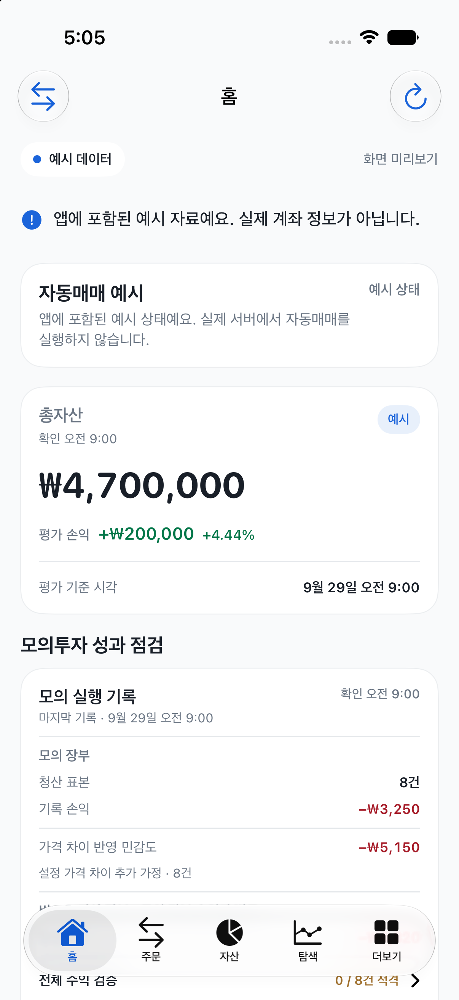
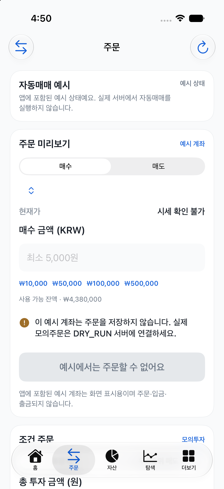

# Native iOS 예시 화면 감사 — 2026-09-29

## 감사 범위

- 대상: iPhone 17 / iOS 27.0 Simulator의 현재 `bundled-preview` 빌드
- 확인 화면: 홈 예시 대시보드와 주문 예시
- 사용자 목표: 실제 계좌·자동매매·주문으로 오인하지 않고, 예시 주문을 실수로 실행하지 않도록 하기
- 두 화면 상태를 캡처한 제한된 감사이며 전체 앱 흐름·웹 PWA 감사는 아니다.

## 1. 홈 예시 대시보드 — 부분 양호

`예시 데이터`, `화면 미리보기`, `예시 상태`가 표시되고, “실제 계좌 정보가 아닙니다” 안내가 총자산·평가손익보다 먼저 보인다. 가상 수익 숫자를 실제 성과로 오인할 위험을 줄이는 구성이다.

하단 Liquid Glass 탭 바 아래로 “전체 수익 검증” 행이 비쳐 일부 내용이 겹쳐 보인다. 이 캡처만으로 해당 행의 스크롤 도달 가능성이나 탭과의 터치 충돌은 판정하지 않았다.

## 2. 주문 예시 — 안전 의미 양호, 상호작용 미확인

`자동매매 예시 / 예시 상태`, `주문 미리보기`, `예시 계좌`가 보이고, 주문이 저장되지 않는다는 안내와 비활성 CTA가 표시된다. 시세 확인 불가와 비활성 금액 입력란도 명시적이다. 현재 소스의 회귀 테스트는 예시 모드에서 주문·지갑 변경 컨트롤이 비활성이고 서버 API 호출이 없음을 확인한다.

조건 주문 카드의 시작 부분도 탭 바와 가까워 화면 하단에서 겹쳐 보인다. 실제 스크롤 조작을 확인하지 못했으므로 항목에 도달할 수 없다고 단정하지 않는다.

## 접근성 위험과 검증 한계

- 비활성 CTA와 보조 문구의 실제 명도 대비, VoiceOver 읽기 순서·상태 전달, 스크롤 후 마지막 입력의 접근성은 이 감사에서 확인하지 않았다.
- 스크린샷은 현재 시뮬레이터 화면에서 새로 캡처하고 직접 확인했다. CUA가 Simulator 앱을 `Invalid app`으로 반환해 탭·스크롤·키보드·VoiceOver 조작은 수행하지 못했다.
- 물리 기기, TestFlight 설치, 실제 서버 연결·계좌 데이터, PWA 설치는 검증하지 않았다. 웹 PWA는 브라우저를 열지 않았고 정적 `verify:pwa`만 통과했다.
- 스크린샷만으로 WCAG 준수나 전체 주문 플로우 완료를 주장하지 않는다.

## 권고

1. 예시 모드의 구분 문구와 비활성 주문 상태는 유지한다.
2. iOS 최소 지원 버전과 최신 iOS에서 스크롤 마지막 행·탭 바 겹침, VoiceOver 순서와 비활성 상태 낭독을 실제 조작으로 확인한다. 시스템 탭 바 배경을 바꾸려 한 수정은 iOS 27 화면에서 표시 효과가 없어 제거했고, 기본 네이티브 탭 외관은 유지했다.
3. 웹 PWA 시각 검증은 사장님이 브라우저를 선택한 뒤 별도 캡처·반응형·키보드 검증으로 진행한다.
