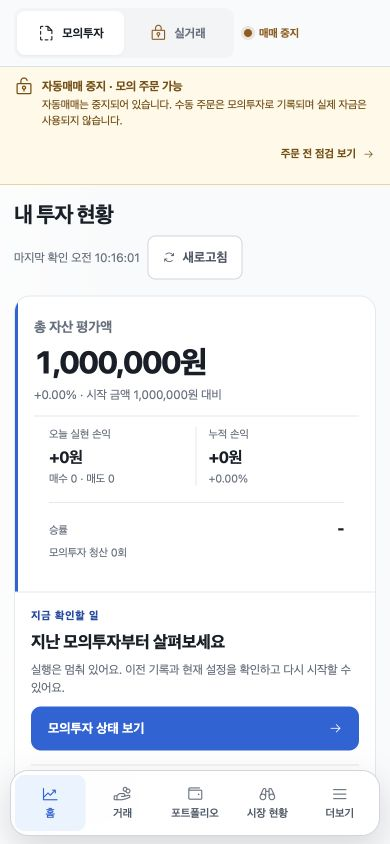
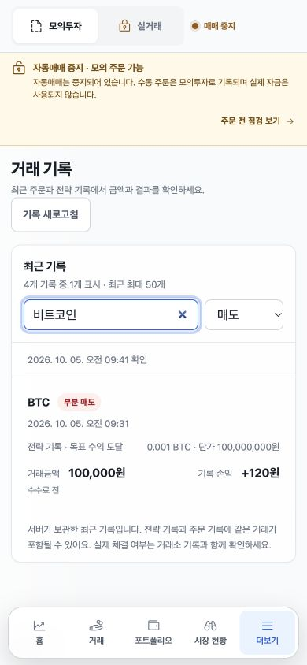

# CoinPilot 사용 경험 개선 및 화면 검증

검토일: 2026-10-05, 한국 시간. 사용자가 자산 변화·거래 결과·다음 행동을 이해하도록 웹/PWA와 SwiftUI 화면을 함께 수정했다. 기존 Toss 기반 디자인과 모의투자/실거래 권한·주문 조건을 유지했다.

## 반영한 서비스 기준

- 첫 연결에서 앱의 용도와 서버 주소·접속 토큰의 차이를 설명한다.
- 홈은 자산 현황과 현재 상태에 맞는 확인 행동을 먼저 제공한다. 네이티브 자산 흐름·최근 거래·주요 시세는 기본으로 펼친다.
- 기록 없음, 필터 결과 없음, 로딩 실패, 이전 자료를 구별하고 실제 동작하는 복구 버튼을 제공한다.
- 기록의 조회 범위를 밝히고, 확인하지 못한 평가액·손익을 0이나 완전한 합계로 바꾸지 않는다.
- 기술지표 판정은 이유와 시각을 함께 보여준다. 판정을 클릭했다고 주문 방향을 강제로 정하거나 주문하지 않는다.
- 작은 상태/보조 글자는 네이티브와 웹 실제 색상 각각에 대해 흰색·paper 배경의 4.5:1 이상 대비를 검사한다.

과업과 완료 기준은 `docs/product-plan.md`의 「사용 경험 개선 기준 — 2026-10-05」에 반영했다. 30초 안에 모드·자산·다음 행동을 이해하는지는 향후 사용자 평가 목표이며, 측정된 사용성 향상 수치가 아니다.

## 발견과 수정

1. 웹 최근 거래의 “전체 기록”이 주문 전 점검으로 잘못 연결됐다. 최근 최대 50개 서버 기록 화면과 유형·종목 필터로 연결했다.
2. 전략의 부분/전체 매도는 최초 매수 시각을 포함하고 있었다. 프론트뿐 아니라 API에서 매도 시점으로 정렬한 뒤 조회 한도를 적용하도록 수정했다. 런타임 Date 객체의 밀리초도 보존한다.
3. 코인 수량, 거래 금액, 미기록 손익, 묶음 주문 두 다리의 의미를 구분했다. 부분 매도와 알려진 종료 이유를 한국어로 표시한다.
4. 계좌가 갱신되어도 손익/거래 조회만 실패할 수 있었다. 자료별 마지막 성공 시각과 갱신 실패를 표시하고, 401/403에서는 해당 데이터를 지운다.
5. 분석 행이 매도 판정이어도 매수 화면으로 이동했다. 분석 상세를 먼저 열고 시세 확인 또는 명시적인 검토 행동을 제공한다.
6. 실제 브라우저에서 분석 상세 버튼이 눌리지 않는 추가 문제를 발견했다. 공통 모달의 배경 닫기 처리가 내부 버튼까지 삼키던 원인을 수정하고 실제 클릭 핸들러 회귀를 추가했다.
7. 모바일에서는 상단 상태/설치 안내가 지나치게 컸고 화면 전환 후 스크롤이 남았다. 설치 안내를 더보기로 옮기고 화면 변경 때만 스크롤을 초기화했다.
8. 시장 검색 결과가 차트·주문 폼 아래에 숨어 있었다. 모바일에서는 같은 목록 DOM을 검색 바로 아래로 이동하고 선택 종목/목록 왕복을 제공한다. 데스크톱으로 넓히면 기존 배치를 복구한다.
9. 네이티브 보유 합계가 일부 시세 누락을 제외한 부분합이었다. 모두 평가 가능할 때만 전체 평가액을 표시한다. 거래 기간 필터는 기기 달력의 자정과 매도 시점을 기준으로 한다.
10. 네이티브 예시 JSON의 ETH 평균단가와 원가/손익이 서로 달랐다. 예시 평균단가와 매수 기록 단가 두 값을 420만 원으로 맞추고, 모든 보유 종목 및 계좌 합계의 정합성 회귀를 추가했다. 재실행한 자산 화면에서 평단420만/현재400만/수량0.05/평가20만/손익-1만을 확인했다.

## 화면별 실제 확인

웹은 인앱 브라우저에서 390×844와 1280×800으로 확인했다. 프로세스별 임시 저장소를 쓰는 기존 결정적 dashboard mock과 localhost 전용 QA 프록시를 이용했다. 거래 네 건/503 오류는 합성 자료이며 QA 프록시는 모든 변경 요청을 차단했다. 캡처 수치와 성과는 실제 계좌·실거래 결과가 아니다.

네이티브는 자격증명을 제거한 `bundled-preview` Mac 앱을 별도 bundle id로 열었다. 같은 SwiftUI 소스의 Mac 실행 결과이며 iPhone 레이아웃·터치·VoiceOver 검증을 대체하지 않는다. iPhone Simulator GUI 앱은 현재 Xcode 설치에서 찾을 수 없어 iPhone 화면은 미검증이다.

| 단계 | 화면/행동 | 결과 | 캡처 |
|---|---|---|---|
| 1 | 수정 전 홈과 최근 거래 목적지 | 문제 재현: 주문 점검으로 잘못 이동 | [이전 홈](01-before-home.png), [잘못된 목적지](02-before-records-destination.png) |
| 2 | 첫 연결과 서버 오류 | 정상: 용도·절차, 입력 유지와 재시도 설명 | [접속 오류](03-connection-error-mobile.png), [주소 입력](04-mobile-setup.png) |
| 3 | 홈의 현재 상태와 다음 행동 | 정상: 모바일/데스크톱 모두 자산과 다음 행동 표시 | [모바일](05-home-mobile.png), [데스크톱](13-home-desktop.png) |
| 4 | 최근 기록→한글 검색+매도 필터→초기화 | 정상: 부분 매도 한 건으로 좁혀지고 초기화 시 네 건 복원 | [거래 필터](06-trade-filter-mobile.png) |
| 5 | 매도 분석→상세→현재 시세 보기 | 정상: 이유·시각·미보유 안내 후 BTC 시장으로 이동, 주문 없음 | [분석 상세](07-analysis-detail-mobile.png) |
| 6 | 손익/거래만 503으로 실패 | 정상: 이전 값 유지, 마지막 성공 시각과 갱신 실패 노출 | [부분 실패](08-partial-refresh-failure-mobile.png) |
| 7 | 모바일 시장 목록→ETH 선택 | 정상: 검색 바로 아래 목록, ETH 시세/차트 전환; 데스크톱 재배치 확인 | [시장 목록](09-market-mobile.png) |
| 8 | 설정 조회 | 정상: 저장된 투자 비율·보유 한도·미제공 손절/익절 구분, 설정 변경 없음 | [설정](15-settings-desktop.png) |
| 9 | 네이티브 홈 안내→보유 자산 | 정상: 기본 노출·안내 버튼 이동·보유 비중 확인 | [Mac 홈](10-native-mac-home.png), [Mac 자산](11-native-mac-assets.png) |
| 10 | 네이티브 내역→오늘 필터→초기화 | 정상: 날짜별 기록, 제공된 손익 건수, 빈 결과 안내, 초기화 후 3건 복원 | [Mac 내역](12-native-mac-records.png), [Mac 빈 결과](14-native-mac-empty-filter.png) |

`11-native-mac-assets.png`는 예시 수치 수정 후 재실행한 최종 캡처다. `12-native-mac-records.png`는 필터 동작을 확인한 수정 전 캡처로 ETH 단가는 400만 원으로 남아 있다. 현재 소스/리소스에서는 420만 원이며 재실행 홈의 접근성 출력에서도 확인했다. 마지막 내역 재캡처 시 Mac이 잠겨 추가 화면 조작을 종료했다.

아래는 검토한 최종 웹 홈과 거래 검색 결과다.

## 검증

- 변경 관련 Node 회귀 144/144 및 마지막 예시 데이터 정합성 2/2, 합계 146개 통과: PWA 기존·신규, 접속 오류, 거래 API 정렬, 양쪽 색상/대비, 예시 원가/손익.
- 신규 네이티브 표시·기간 필터 3/3 통과. `mobile/package.json`의 `test:usefulness`와 루트 `npm test`에 연결했다.
- 기존 Swift Store 45/45를 고정 소스 사본에서 확인한 뒤 현재 소스의 `npm --prefix mobile run test:store`를 다시 실행해 47/47 통과했다. 동시 작업의 파일 수정으로 최초 컴파일이 중단되어 소스를 고정했으며 이후 최종 소스 빌드도 수행했다.
- 최종 iOS Simulator server/bundled-preview 및 Mac bundled-preview 빌드 성공. 검증 사본의 자격증명 제거와 Mac ad hoc 서명 확인.
- ESLint, PWA shell/버전 검사, `git diff --check` 통과. JS `20261005-54`, CSS `20261005-37`, SW `v206`.
- 마지막 완료된 전체 Node 실행은 1,284개 중 1,282개 통과, USDT 평가/호가통화 관련 2개 실패였다. 이후 재실행에서는 USDT 평가 1개와 coordinator 6개 실패가 기록되고 완료 요약 없이 정체되어 해당 실행만 종료했다. coordinator는 앞선 별도 집중 재실행에서는 통과했지만, 이 사실을 전체 통과로 대체하지 않는다. 상세 상태는 `verification.json`에 기록했다.

## 범위와 남은 확인

배포·TestFlight 업로드·실계좌 주문·자동매매 설정 변경은 수행하지 않았다. iPhone 실기기, 설치형 PWA 오프라인/업데이트, VoiceOver, 장기간 실서버 갱신은 추가 검증 대상이다. 뉴스/의견/연구의 서비스 가용성이나 전략 수익성, 사용자 재방문율 개선은 이번 결과로 입증하지 않는다.

저장소에는 작업 시작 전 및 작업 중 다른 채팅의 네이티브 아트·인증·주문 통화·서버 복구 변경이 있었다. 그 변경을 보존했다. 특히 `CoinPilotViews.swift`, `CoinPilotStore.swift`, `portfolio.js`의 전체 Git diff를 모두 이번 작업으로 귀속하면 안 된다. 이번 변경은 위 사용 경험·표시·기록 정렬과 그 테스트다.
